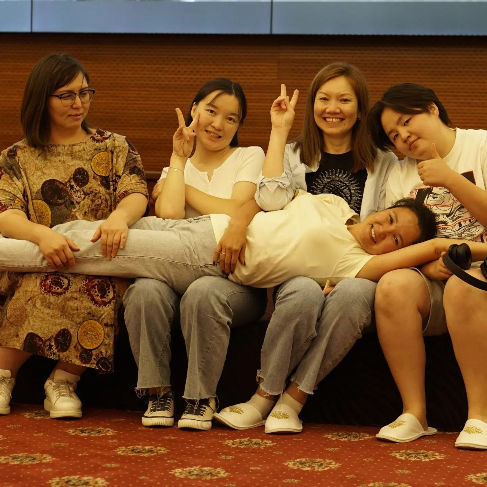
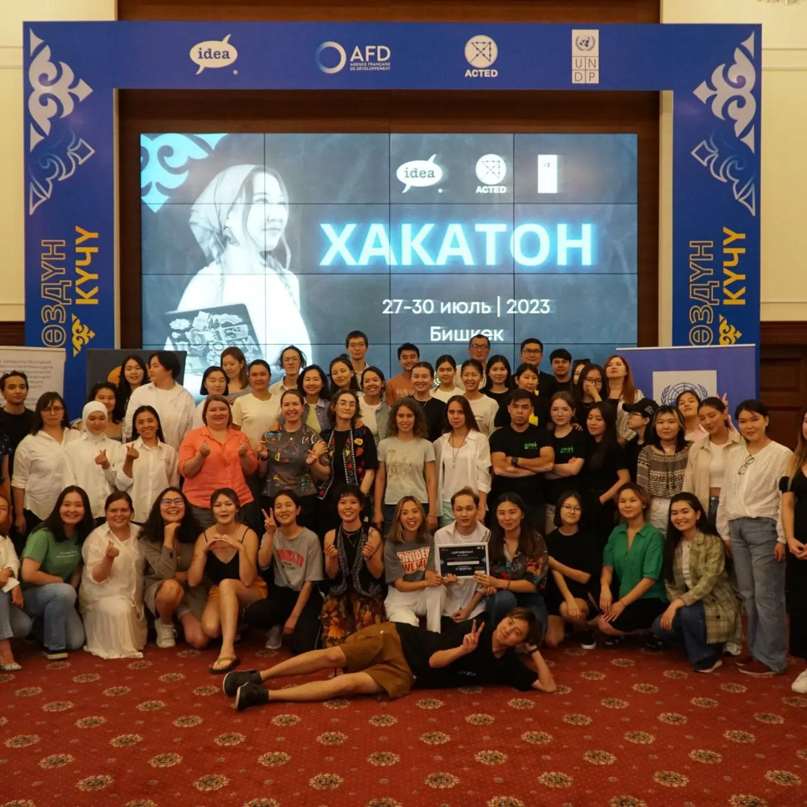
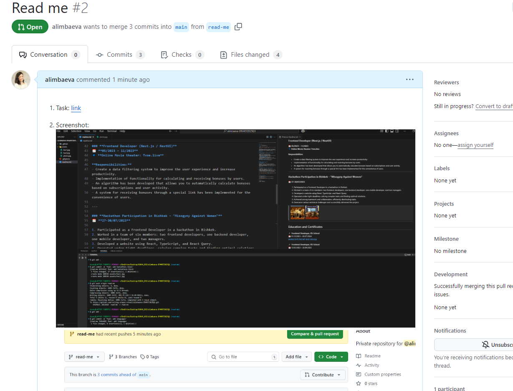
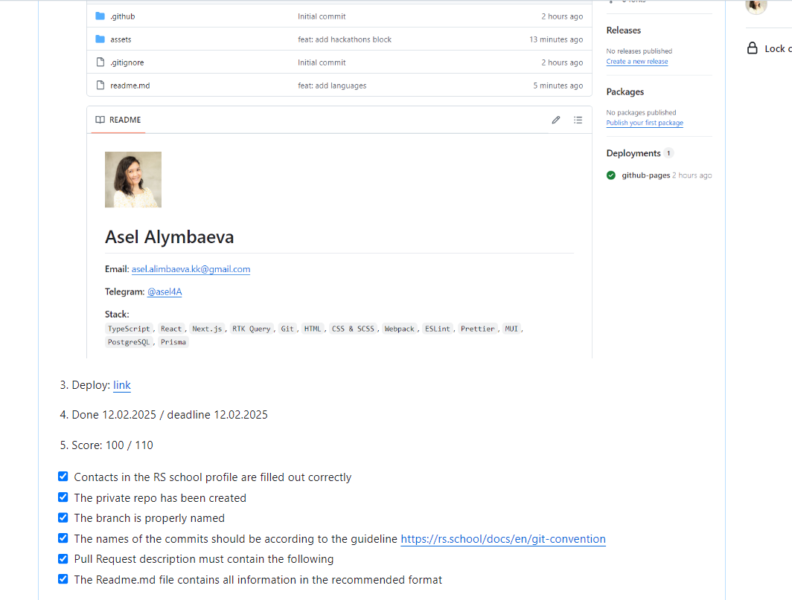

# Asel Alymbaeva  

**Email:** asel.alimbaeva.kk@gmail.com  

**Telegram:** [@asel4A](https://t.me/asel4A)  

**Stack:**  
`TypeScript`, `React`, `Next.js`, `RTK Query`, `Git`, `HTML`, `CSS & SCSS`, `Webpack`, `ESLint`, `Prettier`, `MUI`, `PostgreSQL`, `Prisma`

> ### About me
> I have experience in participating in various hackathons and projects where I work on implementing effective solutions online. In teamwork, I highly value mutual assistance and responsiveness. I am convinced that the right direction of development and current feedback are key factors in achieving outstanding results.

## Work Experience  
1. Frontend Developer - 06/2024 – Until now
2. Frontend Developer - 05/2023 – 11/2023
3. Hackathon Participation in Bishkek: "Misogyny Against Wome - 27-30/07/2023

### **Frontend Developer (Next.js / TypeScript / Tailwind CSS / PostgreSQL / Prisma)**  
📅 **06/2024 – Until now**  
🔹 I'm working on a project to create a travel website **"Времена Года"**.  

**Responsibilities:**  
- Development of the functionality for the tours page. 
- Creating a universal and customizable accordion component. 
- Creating a universal and customizable modal component. 
- Splitting the code into smaller components for dynamic content transfer and reuse.
- Implemented an **administration page** where the admin can:  
  - Create and modify **tour orders**.  
  - Add **new tourists** or assign existing ones to a tour.  
  - Delete tourists and edit **tourist and user data**.  
- Developed queries using Prisma and PostgreSQL to get data to the frontend.
- I combined several tables to form the necessary samples.
- Excluded confidential data (passwords, passport data, and other sensitive fields) to ensure security.
- Optimized the data transfer to the client side.
- Used **server-side-rendered components** for static content and **client-side-rendered components** for interactive features.  

---

### **Frontend Developer (Next.js / NextUI)**  
📅 **05/2023 – 11/2023**  
🔹 **Online Movie theater: Tvoe.live**  

**Responsibilities:**  
- Create a data filtering system to improve the user experience and increase productivity.  
- Implementation of functionality for calculating and receiving bonuses by users.
- An algorithm has been developed that allows you to automatically calculate bonuses based on subscriptions and user activity.
- A system for receiving bonuses through a special link has been implemented for the convenience of users.

---

### **Hackathon Participation in Bishkek – "Misogyny Against Women"**  
📅 **27-30/07/2023**  

1. Participated as a Frontend Developer in a hackathon in Bishkek.
2. Worked in a team of six members: two frontend developers, one backend developer, one mobile developer, and two managers.
3. Developed a website using React, TypeScript, and React Query.
4. Operated under tight deadlines, solving complex tasks and finding optimal solutions.
5. Achieved strong teamwork and collaboration, efficiently distributing tasks.
6. Overcame various technical challenges and successfully delivered the project.

> 
> 
> 
> 
---

## Education and Certificates 

🎓 **Frontend Developer, RS-School**  
📅 01.10.2023 – 03.07.2024  
[JAVASCRIPT/FRONT-END 2023Q4](https://app.rs.school/certificate/vnv1baiu)

🎓 **Frontend Developer, RS-School**  
📅 12.03.2022 – 20.09.2022  
[JAVASCRIPT/FRONT-END 2022Q4](https://app.rs.school/certificate/0ck7w2x5)

---

## Languages:

1. English - B1
2. Russian - Advanced level
3. Kyrgyz is a native language

---

### Add PR

> 
> 
> 
> 
---